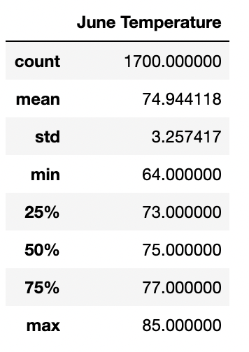
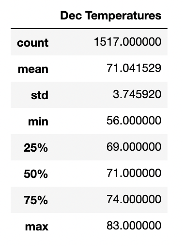

# Module 9 Challenge README

## 1. Overview of Analysis
With the objective of opening a surf shop, investor W. Avy has asked for an analysis of weather data in Oahu, where the shop will be located. The weather anaylsis will look at the temperature and precipitation in the area. It's assumed that rain and cold weather will negatively affect sales - so we're looking for a location with low rainfall and warm temperatures. 

## 2. Results 

The results of the June analysis show, across 1700 pieces of temperature data gathered:

- Average temperature in June from 2010-2017 is ~75F 

- Min temp is 64F

- Max temp is 85F 

The results of the December analysis shows, across 1517 pieces of temperature data gathered:
- Average temperature in December from 2010-2017 is 71F
- Min temp is 56F
- Max is 83F 

## 3. Summary 
The results show that the temperature in Oahu doesn't fluctuate too dramatically between seasons and stays, on average, in the 70s through the year. This is a perfect temperature for outdoor activities, thus a great location for a surf shop. 
For more information on June and December, I'd run a parallel percipitation query, to understand if December experiences heavy rain despite maintaining warmer temperatures. I'd use the describe function as was done above to get an idea of average, max, min, etc. 
